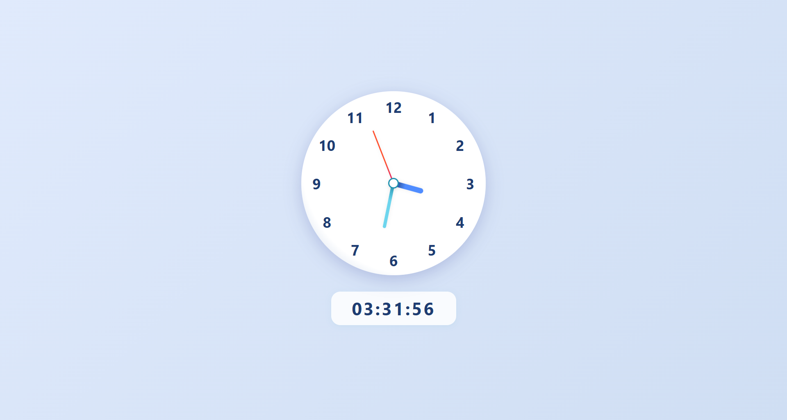
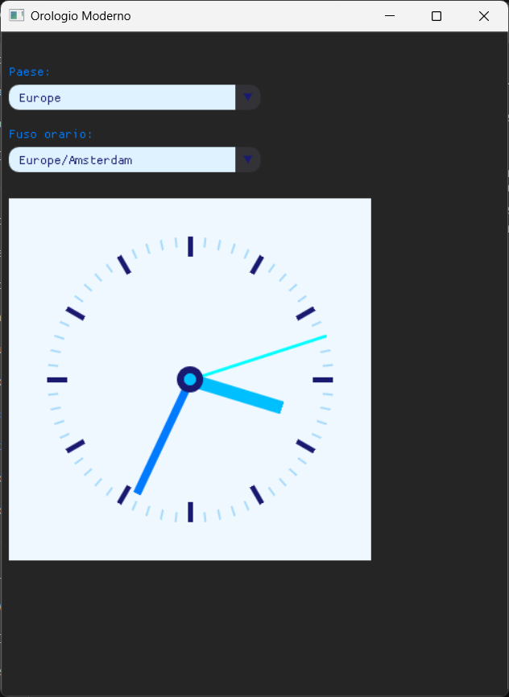

# 🕒 Analog-Digital Clock

A modern **analog and digital** clock, available in both **Web** (HTML/CSS/JS) and **Desktop** (Python with DearPyGui) versions. Designed with an elegant interface, smooth animations, and support for **international time zones**.

---

## Table of Contents

- [Features](#features)
- [Project Structure](#project-structure)
- [Web Version](#web-version)
  - [Requirements](#requirements)
  - [Launch](#launch)
- [Python Version](#python-version)
  - [Requirements](#requirements-1)
  - [Launch](#launch-1)
- [Screenshots](#screenshots)
- [Author](#author)

---

## Features

- 🔰 **Analog** clock with real-time animated hands
- ⏱️ Synchronized **digital** display
- 📱 **Responsive design** for perfect rendering on every device (Web)
- 🌍 **Multi-language and international time zone support** (Python)
- 🎨 Modern interface with **customizable themes**
- ⚙️ **Modular and easily extensible** project

---

## Project Structure

```bash
Analog-Digital-Clock/
│
├── Web_Version/                # Web Version
│   ├── clock.html              # HTML interface
│   ├── clock.css               # Graphic style
│   └── clock.js                # JavaScript logic
│
└── Python_Version/            # Desktop Version
    ├── main.py                 # Main entry point
    ├── gui.py                  # GUI management with DearPyGui
    ├── clock_app.py            # Alternative app version
    ├── clock_dearpygui.py      # Alternative implementation
    └── timezone_helper.py      # Time zone management
```

---

## Web Version

### Requirements

- Modern browser (Chrome, Firefox, Edge, Safari)

### Launch

1. Open the `Web_Version` folder
2. Double-click on `clock.html` or open it in the browser

---

## Python Version

### Requirements

- Python 3.8 or higher
- Required libraries:
  - [`dearpygui`](https://github.com/hoffstadt/DearPyGui)
  - [`pytz`](https://pypi.org/project/pytz/)

Install dependencies with:

```bash
pip install dearpygui pytz
```

### Launch

1. Go to the `Python_Version` folder
2. Run one of the available scripts:

```bash
python main.py
```

or

```bash
python clock_app.py
```

or

```bash
python clock_dearpygui.py
```

---

## Screenshots

### Web Version



### Python Version



---

## Author

**Giuseppe**  
📬 Contributions, questions or suggestions? Feel free to open a *pull request* or contact me!

---

> ⭐ *If you like the project, leave a star on the repo!*
